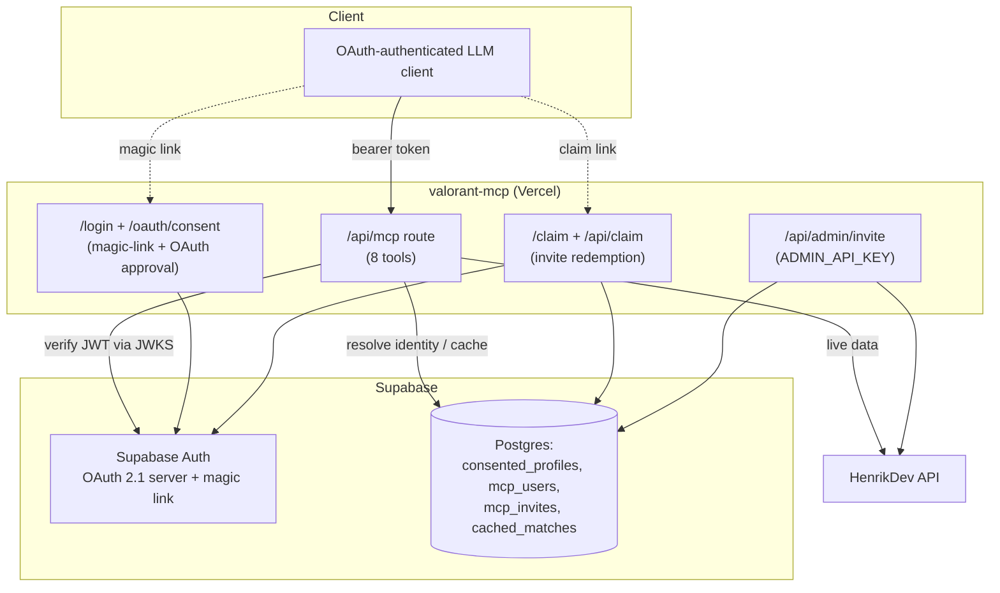
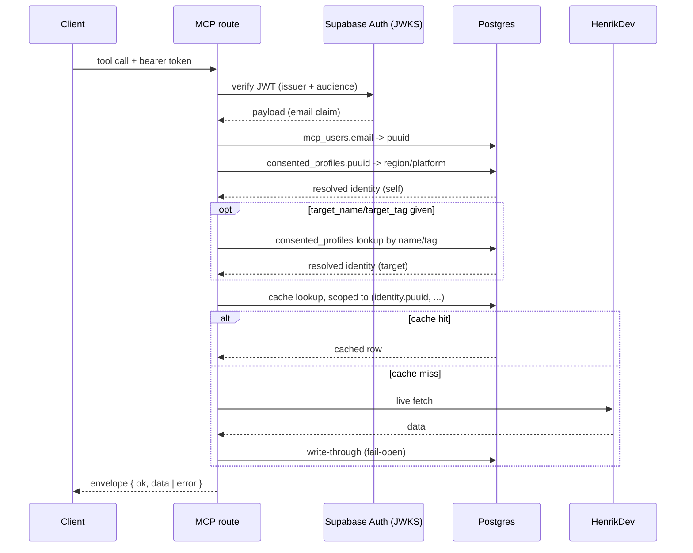
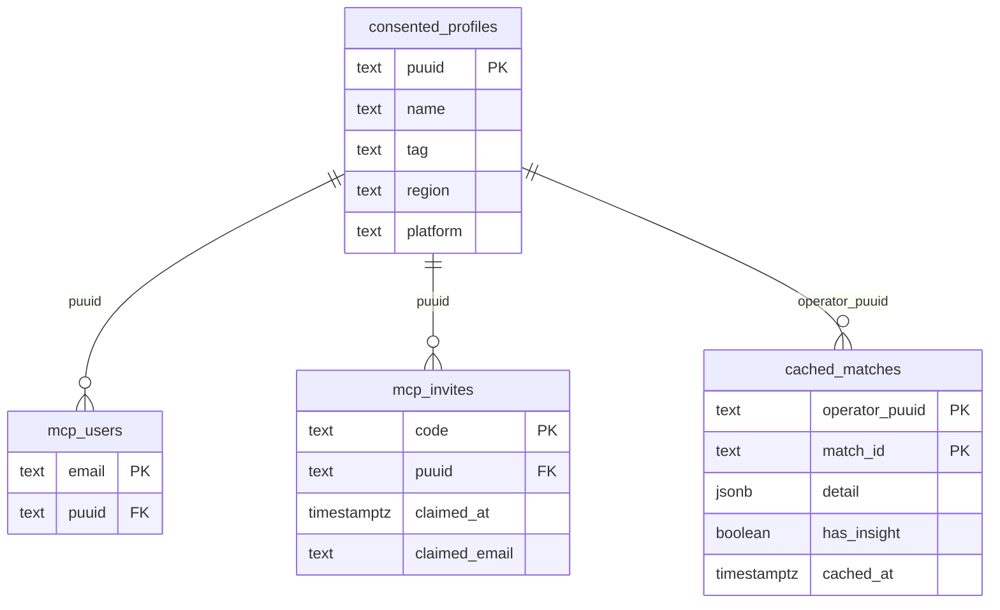

# Architecture

## System boundary

`valorant-mcp` is a private Streamable HTTP MCP server. It provides factual, compact VALORANT data to OAuth-authenticated LLM clients, scoped to each authenticated user's own VALORANT profile and any profile that has explicitly consented to be looked up. HenrikDev is the only data provider. Interpretation and coaching remain with the client model.

## Components

| Component | Responsibility | Depends on |
|---|---|---|
| Next.js MCP route (`app/api/[transport]`) | Serve `/api/mcp`; validate requests, enforce policy, project factual/token-efficient responses | MCP SDK, `mcp-handler`, Identity |
| HenrikDev client (`src/henrik-client.ts`, `src/endpoints.ts`, `src/rate-budget.ts`) | Fetch account, MMR, match-list, and match-detail data under a shared rate budget (Basic tier: 30 req/min) | HenrikDev API |
| Authorization (`src/verify-token.ts`, `app/login`, `app/oauth/consent`) | Authenticate a user through Supabase Auth email magic-link; approve MCP OAuth clients | Supabase Auth |
| Identity (`src/identity.ts`, `src/target.ts`) | Resolve the authenticated request to a VALORANT identity — the caller's own, or (via `target_name`/`target_tag`) a consented profile's | Supabase Postgres, Authorization |
| Onboarding (`app/claim`, `app/api/claim`, `app/api/admin/invite`) | Admin mints a one-time invite code for a Riot ID; the invitee redeems it under whatever email they sign in with | Supabase Postgres, HenrikDev client |
| Cache (`src/match-cache.ts`) | Bounded, per-identity cache of already-authorized match data | Supabase Postgres |

## Architecture



## Request flow: identity resolution and cache



## Data model



## Consent model

Two lists, enforced by a foreign key (`mcp_users.puuid -> consented_profiles.puuid`):

- **`consented_profiles`** ("List 2") — a VALORANT profile whose data may be looked up by anyone with service access. Group-wide consent, not pairwise.
- **`mcp_users`** ("List 1") — grants actual MCP service access, one row per person, keyed by the email in their Supabase-issued JWT. Strictly narrower than List 2: nobody gets service access without also being a consented profile.

An email not present in `mcp_users` is treated identically to an invalid token (401) — List 1 is the auth gate `verify-token.ts` checks, not List 2 directly.

**Onboarding**: `POST /api/admin/invite` (shared-secret `ADMIN_API_KEY`) resolves a Riot ID via HenrikDev, upserts `consented_profiles`, and mints a single-use `mcp_invites` code. The invitee opens `/claim?code=...`, signs in via Supabase magic link with whatever email they choose, and that email becomes their `mcp_users` row.

**Widened lookup**: any tool accepting `target_name`/`target_tag` resolves that pair against `consented_profiles` and acts on the target's identity instead of the caller's own (`src/target.ts`) — never a live HenrikDev name/tag search. A name/tag that isn't a consented profile is rejected the same way whether it doesn't exist or simply hasn't consented (never distinguishing the two). `compare_match`/`compare_rank` resolve their opponent per-call by name/tag within a shared match instead, and `search_match_history` is inherently self-scoped.

Match-participant data (another player's stats within a match the caller played) is treated as in-scope without separate per-participant consent — incidental to a match the caller already consented to, not a targeted lookup. This is a common-sense reading of HenrikDev's public consent policy, not a confirmed ruling from HenrikDev directly; revisit if that changes.

## Cache

`cached_matches` is a bounded, write-through/read-through cache (`src/match-cache.ts`), keyed by `(operator_puuid, match_id)` — never `match_id` alone, since a cache hit must only ever be reachable by the identity that wrote it (otherwise a cache hit could skip that request's own participant check). Two independent retention caps are enforced per-identity after every write: 100 rows and 90 days by `cached_at` (fetch time — completed matches are immutable, so retention bounds history volume, not staleness). All cache operations are fail-open: a Postgres error is logged and treated as a miss/no-op, never surfaced as a tool error, since the live HenrikDev path is always a working fallback.

Two row kinds share the table: "full" rows (`get_match_detail`'s complete response, `has_insight` marking whether per-player insight was included) and "light" rows (`get_recent_matches`/`get_player_stats`' own stat line only, `detail: null`) — a light write never overwrites an existing row of either kind.

## Error mapping

Every MCP tool returns one structured envelope; internal code may throw, but only the tool boundary converts a throw into an envelope (never leak a raw exception or HenrikDev response body to the client).

```ts
interface ToolError {
  kind: "rate" | "upstream" | "schema" | "input";
  message: string;
  retryAfterMs?: number; // present for "rate" only
}
interface Envelope<T> {
  ok: boolean;
  data?: T;
  error?: ToolError;
}
```

| Kind | When | Retryable | Source |
|---|---|---|---|
| `rate` | HenrikDev 429, or the local pre-call budget check refuses the call | yes — surface `retryAfterMs` so the client model can wait or defer, not retry blindly | HenrikDev rate-limit response/headers |
| `upstream` | Any non-429 HenrikDev error, timeout, network failure, or Postgres error not otherwise fail-open | yes, generically | HenrikDev outage/latency, DB errors |
| `schema` | HenrikDev payload doesn't match the expected validated shape | no — retrying won't fix a changed provider contract | provider contract drift |
| `input` | Malformed tool arguments, or a request outside the approved consent/access scope | no | caller/request |

No kind carries a HenrikDev response body or player data in its `message`; `schema` errors may name the offending field path but never its value.

## Tools

| Tool | Purpose | Target-widenable |
|---|---|---|
| `get_profile` | Account profile + current/peak rank | yes |
| `get_recent_matches` | Recent competitive matches (max 10) | yes |
| `get_match_detail` | Compact single-match detail; `include_insight` for per-player facets (KAST, trades, multi-kills, side splits, economy, clutches, party, lobby percentile) | yes |
| `get_player_stats` | Pooled descriptive stats over recent matches (ACS/ADR/KDA/headshot % distributions, survival rate, agent breakdown, rank/climb, best/worst game) | yes |
| `get_rank_history` | Per-match RR/tier trajectory, with `since_match_id` windowing | yes |
| `compare_match` | Head-to-head stats vs. a named opponent within one shared match | opponent resolved per-call |
| `compare_rank` | Live current rank/RR vs. a named opponent found via a shared match | opponent resolved per-call |
| `search_match_history` | Cache-only search over the caller's own previously-detailed matches | no (self-scoped) |

## Contracts and invariants

- HenrikDev's current supported endpoint version is authoritative for each integration; do not reproduce legacy endpoint assumptions.
- Every player-scoped request is checked against the consent/access policy above before an upstream call — no player is ever looked up, cached, or targeted without an explicit `consented_profiles` row.
- API keys, OAuth credentials, player identities, and match data are treated as sensitive: never logged, never committed, never returned beyond what a tool's own contract requires. Logs carry operational metadata only (tool name, outcome, latency, rate-limit state).
- The server returns facts and compact derived descriptive statistics; it does not provide coaching or editorial conclusions. Approximated stats are labeled as such (e.g. `approximate: true`) rather than presented as exact.
- Vercel's Preview and Production environments hold separate env var sets — a new required env var must be added to both.
