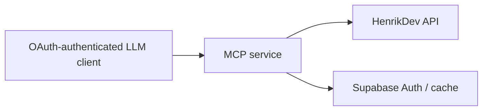

# Architecture

## System boundary

`valorant-mcp` is a private Streamable HTTP MCP server. It provides factual, compact VALORANT data to OAuth-authenticated LLM clients; HenrikDev is the only data provider. Interpretation and coaching remain with the client model.

## Components

| Component | Responsibility | Depends on |
|---|---|---|
| Next.js MCP route | Serve `/api/mcp`; validate requests, enforce policy, project factual/token-efficient responses | MCP SDK, `mcp-handler`, authorization layer |
| HenrikDev client | Fetch current account, MMR, match-list, and match-detail data | HenrikDev API |
| Authorization layer (M1) | Authenticate a user through Supabase Auth email-magic-link; approve MCP clients | Supabase Auth |
| Identity (M4) | Resolve the authenticated request to a consented VALORANT profile (`mcp_users`/`consented_profiles`); onboard new users via one-time invite codes | Supabase Postgres, Authorization layer |
| Cache (M3) | Bounded cache for authorized data only, scoped per resolved identity (M4) | Supabase Postgres |

## Data and control flow



## Contracts and invariants

- HenrikDev’s current supported endpoint version is authoritative for each integration; do not reproduce legacy endpoint assumptions.
- Every player-scoped request must be checked against the approved consent/access policy before an upstream call.
- Match-participant data and M1 retention follow M0's provisional scope decisions (see Decisions log, 2026-07-28). Access beyond the requesting user's own data is gated by the M4 two-list consent model (`consented_profiles`/`mcp_users`, see Decisions log, 2026-07-29) — no player is ever looked up, cached, or targeted without an explicit consented-profile row.
- The server returns facts and compact derived descriptive statistics; it does not provide coaching or editorial conclusions.

## Error mapping (implemented in M1, live in production)

Every MCP tool returns one structured envelope; internal code may throw, but only the tool boundary converts a throw into an envelope (never leak a raw exception or HenrikDev response body to the client).

```ts
interface ToolError {
  kind: "rate" | "upstream" | "schema" | "input";
  message: string;
  retryAfterMs?: number; // present for "rate" only
}
interface Envelope<T> {
  ok: boolean;
  data?: T;
  error?: ToolError;
}
```

| Kind | When | Retryable | Source |
|---|---|---|---|
| `rate` | HenrikDev 429, or the local pre-call budget check refuses the call | yes — surface `retryAfterMs` from `X-RateLimit-Reset` (or the server's `Retry-After`-equivalent) so the client model can wait or defer, not retry blindly | HenrikDev rate-limit response/headers |
| `upstream` | Any non-429 HenrikDev error, timeout, or network failure | yes, generically | HenrikDev outage/latency |
| `schema` | HenrikDev payload doesn't match the expected validated shape (fail-closed decision, above) | no — retrying the same request won't fix a changed provider contract; surfaces as a signal to update the integration | provider contract drift |
| `input` | Malformed tool arguments, or a request outside the approved consent/access scope | no | caller/request |

No kind carries a HenrikDev response body or player data in its `message`; `schema` errors may name the offending field path but never its value.

## Decisions

- 2026-07-27 — use a human-operated project template — work is maintainer-directed; unattended orchestration is not needed.
- 2026-07-27 — use TypeScript on Node.js 24.x with pnpm — familiar local tooling and the supported Vercel runtime align.
- 2026-07-27 — use the official MCP SDK with `mcp-handler` — Streamable HTTP remains standards-based while Vercel route plumbing stays conventional and small.
- 2026-07-27 — use a minimal Next.js application — it matches Vercel’s MCP route pattern and can later host the small M3 profile-enrolment/removal route.
- 2026-07-27 — require strict TypeScript without escape-hatch casts — provider and request data must be validated at system boundaries.
- 2026-07-27 — use a stable `*.vercel.app` production URL — it is free, works as the long-lived OAuth resource identifier, and avoids requiring a custom domain for this personal service.
- 2026-07-27 — use a dedicated Supabase project — authentication, OAuth grants, consent records, and future cache data remain isolated from unrelated applications.
- 2026-07-27 — keep HenrikDev credentials only in Vercel environment secrets for every milestone — provider keys must never reach clients, source control, Supabase, logs, or MCP responses.
- 2026-07-27 — keep all Supabase database access server-side — browser clients authenticate and approve clients only; Vercel performs every application data read and write.
- 2026-07-27 — log operational metadata only — record tool name, outcome, latency, and rate-limit state as needed; never log player data, Riot IDs, access tokens, or HenrikDev response bodies.
- 2026-07-27 — use only Vercel's standard logs in M1 — add no third-party analytics or error-tracking service until there is a reviewed need.
- 2026-07-27 — do not automatically retry HenrikDev calls in M1 — return clear retryable errors for provider timeouts, rate limits, and outages to preserve the provider budget and predictable behavior.
- 2026-07-27 — return stable structured JSON from MCP tools — the server provides facts only; the LLM client is responsible for prose, analysis, and coaching.
- 2026-07-27 — bind M1 to one server-configured PUUID, region, and platform — PUUID is durable while Riot name and tag can change; M3 will move bindings into per-user Supabase records after its policy gate.
- 2026-07-27 — validate HenrikDev payloads at the boundary and fail closed on schema drift — do not guess at changed fields or return partial data; tests and manual live checks should surface provider changes before deployment.
- 2026-07-27 — introduce M0 policy research before implementation — HenrikDev’s written consent policy and upstream Riot expectations leave material scope questions unresolved.
- 2026-07-28 — provisional, subject to revision — treat completed-match participant data as in-scope without separate per-participant consent when the operator was a player in that match; this is incidental to a match the operator already consented to, not a lookup targeting those participants. Standalone lookup of a non-allowlisted player (no shared match, no request) remains out of scope. Basis: HenrikDev’s public consent clause bans arbitrary/analytic lookups on non-consenting users, not compact detail on a match the key holder played; no direct reply from HenrikDev was received, so this is a common-sense reading of published policy, not a confirmed ruling — revisit if HenrikDev responds or policy text changes.
- 2026-07-28 — provisional — if M3 (other-user access) proceeds, use an explicit ask-then-allowlist consent mechanism (a friend requests access, the operator grants it, only then is that person’s profile viewable), consistent with the legacy project’s operator+allowlist model. This decides the consent *mechanism* only; M3 still requires its own usage/capacity go/no-go (HenrikDev key tiers: Basic 30 req/min, Enhanced 90 req/min with 1–2 week approval, Production/Custom requiring justification and not guaranteed) before any multi-user implementation.
- 2026-07-28 — provisional, subject to revision — accept a single-operator hosted MCP as within HenrikDev's Basic/Enhanced key intent for M1–M2. Basis: HenrikDev's "not designed for production apps" language reads as aimed at commercial/multi-tenant scale (the justification and approval workflow only bites at Enhanced/Production tiers), not at one person's own always-on personal deployment; the 30 req/min Basic ceiling is a design constraint to build around (batching, caching, the rate-budget gate), not a signal the use case itself is disallowed. No direct reply from HenrikDev was received — revisit if M3's multi-user volume approaches Enhanced-tier territory, or if HenrikDev's policy text changes.
- 2026-07-28 — provisional, subject to revision — M1 ships with no persistent cache, so it has no retention question to resolve: a tool's output lands in the client's own chat history the moment it's returned. This fully closes M0's retention gap for M1's scope.
- 2026-07-28 — resolves the M2/M3 cache-bound tension flagged above — ROADMAP.md's cache bound (100 matches or 90 days) and HenrikDev's own served-cache TTL (300s free tier, down to 30s on paid tiers) are not actually in conflict: HenrikDev's TTL governs freshness of a single upstream read, while our bound governs how much already-fetched history we retain. Completed-match data is immutable once played, so there is no staleness question for cached matches — only a retention-scope one. M3 (renumbered from M2; see ROADMAP.md) will cache full match detail exactly as already served live (no new consent boundary beyond what M1 already returns), write-through only (no backfill job), with FIFO eviction by match date past the bound. M2 (tool-list expansion) now precedes M3 so the cache schema is designed against M2's final tool/field set, avoiding a follow-up migration.
- 2026-07-28 — M2 scope, decided via grilling session — build M2 as vertical slices, same pattern as M1 (research → one facet/tool → build, verify, ship → repeat), not a single batch. The exhaustive legacy-facet audit (`../valorant-mcp-legacy`) found two tiers: T1 facets need only `stored-matches`/`mmr` (already fetched and validated) — impact-stat distributions, headshot %, per-agent breakdown, survival rate, rank/RR/climb, per-game best/worst dispersion. T2 facets need full `rounds[]`/`kills[]` — KAST, trade rate, first bloods/deaths, multi-kills, per-weapon kills, attack/defense side splits, economy-bucket win rates, plants/defuses, clutch stats, party-size breakdown, lobby-relative percentile standing, and player-vs-player comparison.
- 2026-07-28 — provisional — T2 facets (rounds/kills-derived) are in scope for M2. M1's exclusion of `rounds[]`/`kills[]` from `MatchDetail` was a *response-shape* rule (raw event arrays are too token-heavy to return), not a rule against fetching or processing that data server-side; computing a compact derived stat (e.g., one KAST float) from those arrays and discarding the raw arrays before responding is consistent with M1's existing compaction philosophy, not a new boundary.
- 2026-07-28 — M2 slice order — one foundational slice extends fail-closed zod validation (matching M1's existing pattern in `src/henrik-schemas.ts`) to cover `rounds[]`/`kills[]`, with no new tool exposed yet; every T2 facet slice after that consumes the already-validated shared data instead of re-deriving its own schema. T1 facet slices don't depend on this and can proceed independently since `stored-matches`/`mmr` are already validated.
- 2026-07-28 — `compare_players` (head-to-head stat comparison against another match participant) is in scope for M2, gated the same way as `get_match_detail`'s existing participant-consent reasoning: the other player must be found via the operator's own match history (a participant in a match the operator already played), never via a direct Riot-ID/tag lookup — that standalone-lookup boundary stays closed until M4.
- 2026-07-28 — derived ranking/percentile facets (e.g., lobby-relative standing) return structured data only (metric name + number), never a pre-formatted natural-language sentence — formatting into prose remains the client model's job, per the existing "facts only, client does prose" decision below. Applies to all new M2 tool output, and to spelling out field names/acronyms in full rather than shipping bare abbreviations.
- 2026-07-28 — confirmed live via HenrikDev's `/valorant/v1/content` and existing `v3/by-puuid/mmr` schema — agent names/IDs (29 current agents) and tier names both come directly from HenrikDev responses; no static lookup table is needed for either, unlike legacy's hardcoded `agent-roles.ts`-adjacent name/tier tables. A small static table is still needed for agent **role** (duelist/controller/sentinel/initiator) only, since HenrikDev's content data has no role field — flagged to revisit when a new agent ships (~2-3/year).
- 2026-07-28 — approximation-labeling bar for M2 facets — an inferred/approximated stat is acceptable to ship if the response honestly labels it as such (e.g. an `approximate: true` field), rather than presenting an inference as an exact fact; whether a given approximation is trustworthy enough to ship at all is a per-facet call made during that facet's own slice. Confirmed concretely: weapon-kill counts are exact (`kills[].weapon` is a direct per-kill field), but weapon-based accuracy/headshot % is inherently approximate — HenrikDev's per-shot `damage_events` carry no weapon tag, only a round-level `economy.weapon` (buy-phase loadout), so attribution assumes no mid-round weapon switch.
- 2026-07-28 — new M2 tools are grouped by natural scope rather than one tool per facet: pooled operator stats (T1 facets — impact, headshot %, agent breakdown, survival, rank/climb), single-match insight (T2 per-match facets — KAST, trades, first bloods, multi-kills, side splits, economy, clutch, party size, lobby percentile), and player comparison (`compare_players`). Each tool's exact shape is still decided individually per slice, not fixed by this entry.
- 2026-07-28 — `compare_players` split into two narrower tools once designed: `compare_match` (single-match head-to-head, essentially free — reuses per-match insight already computed for every participant) and `compare_rank` (live current rank/RR comparison). `compare_rank` needed its own consent resolution, provisional and narrower than the 2026-07-28 match-participant entry above: a live MMR lookup for a non-operator player reveals something about that person *after and independent of* the shared match, not just what happened in it, so it's gated more tightly than incidental match-detail — the opponent must still be found via a specific match the operator provides (same lookup as `compare_match`, never a fresh Riot-ID search), and only their `current` tier/RR is returned, nothing else (no history, no peak, no other fields). Revisit if this narrow reading proves too limited or if HenrikDev's policy clarifies live-lookup expectations.
- 2026-07-28 — supersedes the 2026-07-27 Discord-login decision — use Supabase Auth's own email magic-link (passwordless), not Discord, for hosted access. Supabase Auth alone provides the managed OAuth 2.1/MCP authorization server the protocol needs; Discord was a bundled identity-provider choice, not a requirement of it, and dropping it removes an external OAuth app/secret and a token-exchange failure mode with no compensating benefit for a single-operator server. Revisit only if M3 wants Discord identity specifically for allowlist purposes.
- 2026-07-28 — operational note, not a design decision, but recorded because it silently broke production once: Vercel's Preview and Production environments hold **separate** env var sets. Connecting the GitHub repo to Vercel makes every `main` push an automatic Production build; if the five required vars (`HENRIKDEV_API_KEY`, `VALORANT_OPERATOR_PUUID`, `VALORANT_REGION`, `NEXT_PUBLIC_SUPABASE_URL`, `NEXT_PUBLIC_SUPABASE_PUBLISHABLE_KEY`) are only added to Preview, every Production build fails at `loadConfig`/`requireEnv` during page-data collection. Set new required env vars in **both** environments going forward.
- 2026-07-29 — M3's first slice, decided via grilling session — built as the narrowest complete vertical (schema → write-through → read tool) rather than the full cache described in ROADMAP.md at once. Only `get_match_detail` writes to `cached_matches` (`get_recent_matches`/`get_player_stats` don't yet — a later slice); `get_match_detail` itself stays always-live, with no cache-hit read-through yet (also deferred). Retention is two independent caps enforced synchronously after every write (no scheduled job): rows older than 90 days by `cached_at` (fetch time, not match time — completed-match data is immutable, so retention is about how much fetched history we keep, not staleness) are deleted, and rows beyond the 100 most-recently-cached are separately trimmed. The cache write is fail-open: a Postgres error is logged and swallowed, never surfacing as a `get_match_detail` tool error, since caching is a best-effort side effect of an already-successful call. No new consent boundary — only the operator's own already-authorized match data is cached, no `operator_puuid` column (single-tenant, hardcoded). Added the cache-only `search_match_history` tool per ROADMAP.md, returning `get_recent_matches`'s existing `RecentMatch` shape; empty results are `ok:true` (an unpopulated or partially-populated cache is expected, not an error). DB access is `@supabase/supabase-js`'s service-role `createClient` (new `SUPABASE_SERVICE_ROLE_KEY`), module-scoped like `route.ts`'s other deps — distinct from `supabase-server.ts`/`supabase-browser.ts`, which are cookie-bound to the separate web login flow and unusable in the MCP route's bearer-token context. The `cached_matches` table was applied directly to the "VALORANT MCP" Supabase project via the Supabase MCP tool (no Supabase CLI/migration workflow in use yet), with a copy of the SQL kept in `supabase/migrations/` as a durable record only; RLS is enabled with zero policies (only the service-role key has any legitimate reason to touch this table). Widening to the other write paths and read-through are explicit next M3 slices, not part of this one.
- 2026-07-29 — M3 slice 2, decided via grilling session — `get_match_detail` now reads through `cached_matches` before calling HenrikDev. A cached row only satisfies a request if `include_insight` is false/absent, or if `include_insight` is true and the row's `has_insight` column (new, explicit — not inferred from a coincidental field in the stored `detail`) is also true; otherwise it's treated as a miss, falls through to the live path, and the live result upgrades (upserts) the row. The stored `detail` jsonb is validated against `MatchDetail`'s shape on every read (zod, no unchecked casts, same boundary discipline as HenrikDev payloads); a validation failure — e.g. a future response-shape change making an old cached row's shape stale — is treated as a plain miss, not a `SchemaError`, since the live path is always a working fallback here, unlike HenrikDev's own schema-drift failures which have none. Any cache-lookup failure (thrown error, not just "no row") is likewise fail-open: logged and swallowed, treated as a miss, mirroring the write-path's existing fail-open decision above. A cache hit does not refresh `cached_at` (retention stays FIFO by fetch time, not LRU). Accepted limitation, not designed around: if `match-insight.ts`'s derivation logic changes later, previously-cached `has_insight: true` rows keep serving the old computation until naturally evicted or re-upgraded — no versioning/invalidation was added for this, since matches are immutable and only our own code changing would cause drift; revisit only if that actually happens.
- 2026-07-29 — M3 slice 3, decided via grilling session — widened write-through to `get_recent_matches`/`get_player_stats`, writing "light" rows (operator's own stat line only — `stored-matches` has no other participants, so this can never be a valid `MatchDetail`) to the same `cached_matches` table. `detail` is now nullable to represent a light row. A light write never overwrites an existing row, light or full (`ON CONFLICT (match_id) DO NOTHING`, via `supabase-js`'s `ignoreDuplicates`), since light data is never better than what's already there — this is enforced by a new batch method, `MatchCache.insertLightMatches`, distinct from the existing single-row `upsert` (different semantics: many rows, insert-only, one eviction pass for the whole batch rather than one per row). Both writer tools call it independently after fetching their own matches (harmless overlap — idempotent due to insert-only-if-absent), each fail-open on write failure, same as `get_match_detail`'s existing pattern. `season` was added to `storedMatchItemSchema` (confirmed present live, previously unvalidated — same fix as slice 1's `matchByIdSchema`), so light rows support the `act` filter too. Eviction stays uniform `cached_at`-FIFO across light and full rows — a burst of light writes could in principle push an older full-detail row out of the 100-row bound before a light row would be evicted on its own merits; accepted as a known trade-off rather than building two-tier retention priority, consistent with ROADMAP.md's flat "100 matches or 90 days" framing.
- 2026-07-29 — operational note, not a design decision: re-verified M1's rate-budget behavior per ROADMAP.md's M3 item, after slices 2–3 dropped real HenrikDev call volume. No code change was needed — `RateBudget`/`HenrikClient` reserve a slot per actual outbound `.get()` call (`src/henrik-client.ts`), not per MCP tool invocation, so a cache hit (slice 2) or a cache-only tool (`search_match_history`) already consumes zero budget by construction; nothing in the codebase assumed a fixed call-count-per-tool that the cache would now make stale. Confirmed live during slice 2's verification: a cache-hit `get_match_detail` call made 0 HenrikDev calls.
- 2026-07-29 — M4, decided via grilling session, built as four vertical slices. Two-list consent model: `consented_profiles` (List 2) is a VALORANT profile (puuid/name/tag/region/platform) whose data may be looked up by anyone with service access — group-wide consent, not pairwise; `mcp_users` (List 1) grants actual MCP service access, one row per person keyed by the email in their Supabase-issued JWT, with a foreign key to `consented_profiles` enforcing List 1 ⊆ List 2 (nobody gets service access without also being a consented profile). Capacity: no indexing/pagination concerns at the confirmed ~3-user scale.
- 2026-07-29 — M4 slice 1: identity moved from env-loaded `ServerConfig` (`VALORANT_OPERATOR_PUUID`/`REGION`/`PLATFORM`, deleted) to per-request resolution. `verify-token.ts` extracts the verified JWT's `email` claim, looks it up in `mcp_users` then `consented_profiles`, and stashes `{operatorPuuid, operatorRegion, operatorPlatform}` on `AuthInfo.extra`; an email not present in `mcp_users` is treated identically to an invalid token (`undefined` → 401) — List 1 is the auth gate, not List 2 directly. Every tool handler in `route.ts` reads this back via `resolveIdentity` (`src/identity.ts`), which parses `AuthInfo.extra` with zod rather than casting it, since the SDK types it as `Record<string, unknown>`; `withMcpAuth`'s `required: true` guarantees a request never reaches a tool handler without one, so a parse failure there means that invariant broke, not a client-supplied bad value. `supabase-cache-client.ts` was renamed `supabase-service-client.ts` (`createServiceClient`) since the same service-role client now backs both `cached_matches` and the new identity tables, not just the cache.
- 2026-07-29 — M4 slice 2: `cached_matches`' primary key changed from `match_id` alone to `(operator_puuid, match_id)`, not just an added column. This is correctness-critical, not an optimization: `get_match_detail`'s read-through (M3 slice 2) trusts a cache hit without re-checking the requesting operator was a participant — safe under M1/M3's single hardcoded operator, but unsafe the moment a second identity exists, since a cache hit for a match operator A cached could otherwise be served to operator B regardless of whether B ever played it. Making `operator_puuid` part of the primary key enforces the fix by construction: a lookup scoped to B's own puuid can only ever find rows B itself wrote, so B always falls through to the live path (which still enforces the participant check) for a match only A has cached. Every `MatchCache` method (`upsert`, `getDetail`, `insertLightMatches`, `search`) now takes `operatorPuuid` as an explicit first argument, and retention (100 rows / 90 days) is enforced per-operator, not cache-wide — one operator's usage must never evict another's rows. Existing rows were backfilled with the one operator who had ever used the deployment before this migration.
- 2026-07-29 — M4 slice 3: onboarding uses a one-time invite code (`mcp_invites`: code, puuid, claimed_at/claimed_email), not a pre-registered email. Originally scoped as "admin seeds `mcp_users(email, puuid)` directly," but revised when it became clear that requires deciding a friend's exact login email in advance — an invite code instead fixes only *which puuid* it grants (already consent-gated via `consented_profiles`), and whoever redeems it (`app/api/claim/route.ts`, backed by `app/claim/page.tsx`) becomes that puuid's `mcp_users` row under whatever email they actually authenticate with via Supabase's existing magic-link flow. Single-use: a second redemption attempt on a claimed code is rejected. The admin's own `mcp_users` row (from slice 1) was seeded directly with no invite code, since the admin's email was already known without needing to ask anyone. HenrikDev's `GET /valorant/v2/account/{name}/{tag}` (opposite direction of the `by-puuid` endpoints M1/M2 use) resolves a Riot ID to puuid/region for the admin's one-off `consented_profiles` insert when onboarding someone new — confirmed live; not built into `Endpoints`/exposed as an MCP tool, since it's an admin-only onboarding step, not client-facing product surface.
- 2026-07-29 — M4 slice 4: `get_profile`/`get_recent_matches`/`get_match_detail`/`get_player_stats`/`get_rank_history` gained optional `target_name`/`target_tag` params (`src/target.ts`'s `resolveTarget`), resolved only against `consented_profiles` — never a live HenrikDev name/tag lookup, consistent with the existing "never a fresh Riot-ID search" pattern from `compare_match`/`compare_rank`. Giving only one of the pair is a plain input error; a name/tag that isn't a consented profile is rejected the same way whether it doesn't exist or simply hasn't consented, never distinguishing the two (same non-enumerable-failure shape as `compare_match`'s opponent-not-found). Implemented entirely in `route.ts`: it resolves the effective identity (self or target) before calling the existing tool function, so none of the five tools' own logic changed — a target's `get_match_detail` call correctly re-runs the participant check against the target, and any cache read/write-through correctly scopes to the target's own `operator_puuid` (slice 2's scoping applies unchanged to whoever's data is being viewed). `compare_match`/`compare_rank`/`search_match_history` were deliberately left out — the first two already resolve an opponent per-call by name/tag within a shared match, and cache search is inherently self-scoped by design.
