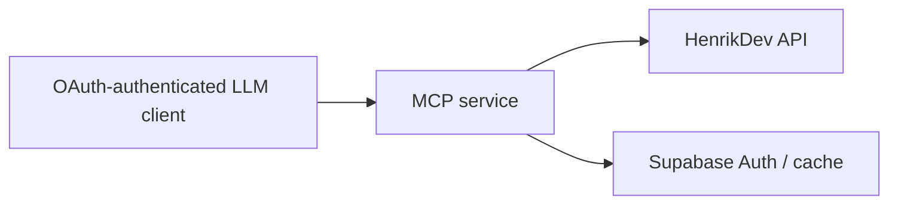

# Architecture

## System boundary

`valorant-mcp` will be a private Streamable HTTP MCP server. It will provide factual, compact VALORANT data to OAuth-authenticated LLM clients; HenrikDev is the only data provider. Interpretation and coaching remain with the client model.

## Components

| Component | Responsibility | Depends on |
|---|---|---|
| Component | Responsibility | Depends on |
| Next.js MCP route | Serve `/api/mcp`; validate requests, enforce policy, project factual/token-efficient responses | MCP SDK, `mcp-handler`, authorization layer |
| HenrikDev client | Fetch current account, MMR, match-list, and match-detail data | HenrikDev API |
| Authorization layer (M1) | Authenticate the owner through Supabase Auth and Discord; approve MCP clients | Supabase Auth, Discord |
| Cache (M2) | Bounded cache for authorized data only | Supabase Postgres |

## Data and control flow

## Contracts and invariants

- HenrikDev’s current supported endpoint version is authoritative for each integration; do not reproduce legacy endpoint assumptions.
- Every player-scoped request must be checked against the approved consent/access policy before an upstream call.
- M0 must settle the allowed scope for match-participant data, cross-player profile access, hosted use, and retained data before those capabilities are implemented.
- The server returns facts and compact derived descriptive statistics; it does not provide coaching or editorial conclusions.

## Decisions

- 2026-07-27 — use a human-operated project template — work is maintainer-directed; unattended orchestration is not needed.
- 2026-07-27 — use TypeScript on Node.js 24.x with pnpm — familiar local tooling and the supported Vercel runtime align.
- 2026-07-27 — use the official MCP SDK with `mcp-handler` — Streamable HTTP remains standards-based while Vercel route plumbing stays conventional and small.
- 2026-07-27 — use a minimal Next.js application — it matches Vercel’s MCP route pattern and can later host the small M3 profile-enrolment/removal route.
- 2026-07-27 — require strict TypeScript without escape-hatch casts — provider and request data must be validated at system boundaries.
- 2026-07-27 — use Supabase Auth with Discord login for hosted access — it provides managed OAuth 2.1/MCP support while keeping Vercel as the server host.
- 2026-07-27 — use a stable `*.vercel.app` production URL — it is free, works as the long-lived OAuth resource identifier, and avoids requiring a custom domain for this personal service.
- 2026-07-27 — use a dedicated Supabase project — authentication, OAuth grants, consent records, and future cache data remain isolated from unrelated applications.
- 2026-07-27 — keep HenrikDev credentials only in Vercel environment secrets for every milestone — provider keys must never reach clients, source control, Supabase, logs, or MCP responses.
- 2026-07-27 — keep all Supabase database access server-side — browser clients authenticate and approve clients only; Vercel performs every application data read and write.
- 2026-07-27 — log operational metadata only — record tool name, outcome, latency, and rate-limit state as needed; never log player data, Riot IDs, access tokens, or HenrikDev response bodies.
- 2026-07-27 — use only Vercel's standard logs in M1 — add no third-party analytics or error-tracking service until there is a reviewed need.
- 2026-07-27 — do not automatically retry HenrikDev calls in M1 — return clear retryable errors for provider timeouts, rate limits, and outages to preserve the provider budget and predictable behavior.
- 2026-07-27 — return stable structured JSON from MCP tools — the server provides facts only; the LLM client is responsible for prose, analysis, and coaching.
- 2026-07-27 — bind M1 to one server-configured PUUID, region, and platform — PUUID is durable while Riot name and tag can change; M3 will move bindings into per-user Supabase records after its policy gate.
- 2026-07-27 — validate HenrikDev payloads at the boundary and fail closed on schema drift — do not guess at changed fields or return partial data; tests and manual live checks should surface provider changes before deployment.
- 2026-07-27 — introduce M0 policy research before implementation — HenrikDev’s written consent policy and upstream Riot expectations leave material scope questions unresolved.
