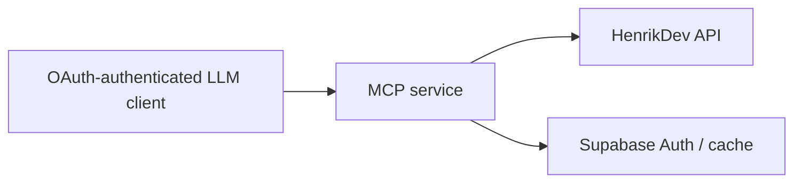

# Architecture

## System boundary

`valorant-mcp` is a private Streamable HTTP MCP server. It provides factual, compact VALORANT data to OAuth-authenticated LLM clients; HenrikDev is the only data provider. Interpretation and coaching remain with the client model.

## Components

| Component | Responsibility | Depends on |
|---|---|---|
| Next.js MCP route | Serve `/api/mcp`; validate requests, enforce policy, project factual/token-efficient responses | MCP SDK, `mcp-handler`, authorization layer |
| HenrikDev client | Fetch current account, MMR, match-list, and match-detail data | HenrikDev API |
| Authorization layer (M1) | Authenticate the owner through Supabase Auth email-magic-link; approve MCP clients | Supabase Auth |
| Cache (M3) | Bounded cache for authorized data only | Supabase Postgres |

## Data and control flow



## Contracts and invariants

- HenrikDev’s current supported endpoint version is authoritative for each integration; do not reproduce legacy endpoint assumptions.
- Every player-scoped request must be checked against the approved consent/access policy before an upstream call.
- Match-participant data, hosted single-operator use, and M1 retention follow M0's provisional scope decisions (see Decisions log, 2026-07-28); access to any player beyond the operator remains gated behind M3's own consent/capacity go/no-go.
- The server returns facts and compact derived descriptive statistics; it does not provide coaching or editorial conclusions.

## Error mapping (implemented in M1, live in production)

Every MCP tool returns one structured envelope; internal code may throw, but only the tool boundary converts a throw into an envelope (never leak a raw exception or HenrikDev response body to the client).

```ts
interface ToolError {
  kind: "rate" | "upstream" | "schema" | "input";
  message: string;
  retryAfterMs?: number; // present for "rate" only
}
interface Envelope<T> {
  ok: boolean;
  data?: T;
  error?: ToolError;
}
```

| Kind | When | Retryable | Source |
|---|---|---|---|
| `rate` | HenrikDev 429, or the local pre-call budget check refuses the call | yes — surface `retryAfterMs` from `X-RateLimit-Reset` (or the server's `Retry-After`-equivalent) so the client model can wait or defer, not retry blindly | HenrikDev rate-limit response/headers |
| `upstream` | Any non-429 HenrikDev error, timeout, or network failure | yes, generically | HenrikDev outage/latency |
| `schema` | HenrikDev payload doesn't match the expected validated shape (fail-closed decision, above) | no — retrying the same request won't fix a changed provider contract; surfaces as a signal to update the integration | provider contract drift |
| `input` | Malformed tool arguments, or a request outside the approved consent/access scope | no | caller/request |

No kind carries a HenrikDev response body or player data in its `message`; `schema` errors may name the offending field path but never its value.

## Decisions

- 2026-07-27 — use a human-operated project template — work is maintainer-directed; unattended orchestration is not needed.
- 2026-07-27 — use TypeScript on Node.js 24.x with pnpm — familiar local tooling and the supported Vercel runtime align.
- 2026-07-27 — use the official MCP SDK with `mcp-handler` — Streamable HTTP remains standards-based while Vercel route plumbing stays conventional and small.
- 2026-07-27 — use a minimal Next.js application — it matches Vercel’s MCP route pattern and can later host the small M3 profile-enrolment/removal route.
- 2026-07-27 — require strict TypeScript without escape-hatch casts — provider and request data must be validated at system boundaries.
- 2026-07-27 — use a stable `*.vercel.app` production URL — it is free, works as the long-lived OAuth resource identifier, and avoids requiring a custom domain for this personal service.
- 2026-07-27 — use a dedicated Supabase project — authentication, OAuth grants, consent records, and future cache data remain isolated from unrelated applications.
- 2026-07-27 — keep HenrikDev credentials only in Vercel environment secrets for every milestone — provider keys must never reach clients, source control, Supabase, logs, or MCP responses.
- 2026-07-27 — keep all Supabase database access server-side — browser clients authenticate and approve clients only; Vercel performs every application data read and write.
- 2026-07-27 — log operational metadata only — record tool name, outcome, latency, and rate-limit state as needed; never log player data, Riot IDs, access tokens, or HenrikDev response bodies.
- 2026-07-27 — use only Vercel's standard logs in M1 — add no third-party analytics or error-tracking service until there is a reviewed need.
- 2026-07-27 — do not automatically retry HenrikDev calls in M1 — return clear retryable errors for provider timeouts, rate limits, and outages to preserve the provider budget and predictable behavior.
- 2026-07-27 — return stable structured JSON from MCP tools — the server provides facts only; the LLM client is responsible for prose, analysis, and coaching.
- 2026-07-27 — bind M1 to one server-configured PUUID, region, and platform — PUUID is durable while Riot name and tag can change; M3 will move bindings into per-user Supabase records after its policy gate.
- 2026-07-27 — validate HenrikDev payloads at the boundary and fail closed on schema drift — do not guess at changed fields or return partial data; tests and manual live checks should surface provider changes before deployment.
- 2026-07-27 — introduce M0 policy research before implementation — HenrikDev’s written consent policy and upstream Riot expectations leave material scope questions unresolved.
- 2026-07-28 — provisional, subject to revision — treat completed-match participant data as in-scope without separate per-participant consent when the operator was a player in that match; this is incidental to a match the operator already consented to, not a lookup targeting those participants. Standalone lookup of a non-allowlisted player (no shared match, no request) remains out of scope. Basis: HenrikDev’s public consent clause bans arbitrary/analytic lookups on non-consenting users, not compact detail on a match the key holder played; no direct reply from HenrikDev was received, so this is a common-sense reading of published policy, not a confirmed ruling — revisit if HenrikDev responds or policy text changes.
- 2026-07-28 — provisional — if M3 (other-user access) proceeds, use an explicit ask-then-allowlist consent mechanism (a friend requests access, the operator grants it, only then is that person’s profile viewable), consistent with the legacy project’s operator+allowlist model. This decides the consent *mechanism* only; M3 still requires its own usage/capacity go/no-go (HenrikDev key tiers: Basic 30 req/min, Enhanced 90 req/min with 1–2 week approval, Production/Custom requiring justification and not guaranteed) before any multi-user implementation.
- 2026-07-28 — provisional, subject to revision — accept a single-operator hosted MCP as within HenrikDev's Basic/Enhanced key intent for M1–M2. Basis: HenrikDev's "not designed for production apps" language reads as aimed at commercial/multi-tenant scale (the justification and approval workflow only bites at Enhanced/Production tiers), not at one person's own always-on personal deployment; the 30 req/min Basic ceiling is a design constraint to build around (batching, caching, the rate-budget gate), not a signal the use case itself is disallowed. No direct reply from HenrikDev was received — revisit if M3's multi-user volume approaches Enhanced-tier territory, or if HenrikDev's policy text changes.
- 2026-07-28 — provisional, subject to revision — M1 ships with no persistent cache, so it has no retention question to resolve: a tool's output lands in the client's own chat history the moment it's returned. This fully closes M0's retention gap for M1's scope.
- 2026-07-28 — resolves the M2/M3 cache-bound tension flagged above — ROADMAP.md's cache bound (100 matches or 90 days) and HenrikDev's own served-cache TTL (300s free tier, down to 30s on paid tiers) are not actually in conflict: HenrikDev's TTL governs freshness of a single upstream read, while our bound governs how much already-fetched history we retain. Completed-match data is immutable once played, so there is no staleness question for cached matches — only a retention-scope one. M3 (renumbered from M2; see ROADMAP.md) will cache full match detail exactly as already served live (no new consent boundary beyond what M1 already returns), write-through only (no backfill job), with FIFO eviction by match date past the bound. M2 (tool-list expansion) now precedes M3 so the cache schema is designed against M2's final tool/field set, avoiding a follow-up migration.
- 2026-07-28 — supersedes the 2026-07-27 Discord-login decision — use Supabase Auth's own email magic-link (passwordless), not Discord, for hosted access. Supabase Auth alone provides the managed OAuth 2.1/MCP authorization server the protocol needs; Discord was a bundled identity-provider choice, not a requirement of it, and dropping it removes an external OAuth app/secret and a token-exchange failure mode with no compensating benefit for a single-operator server. Revisit only if M3 wants Discord identity specifically for allowlist purposes.
- 2026-07-28 — operational note, not a design decision, but recorded because it silently broke production once: Vercel's Preview and Production environments hold **separate** env var sets. Connecting the GitHub repo to Vercel makes every `main` push an automatic Production build; if the five required vars (`HENRIKDEV_API_KEY`, `VALORANT_OPERATOR_PUUID`, `VALORANT_REGION`, `NEXT_PUBLIC_SUPABASE_URL`, `NEXT_PUBLIC_SUPABASE_PUBLISHABLE_KEY`) are only added to Preview, every Production build fails at `loadConfig`/`requireEnv` during page-data collection. Set new required env vars in **both** environments going forward.
